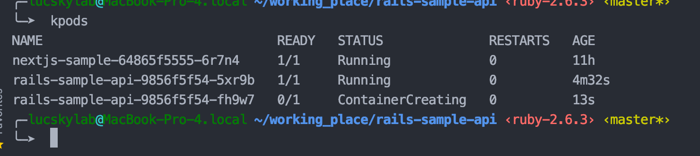
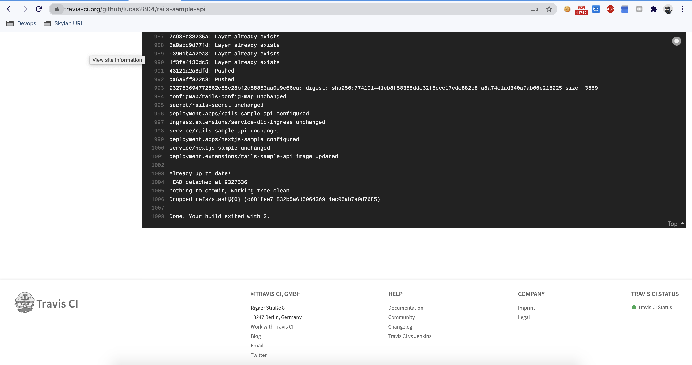
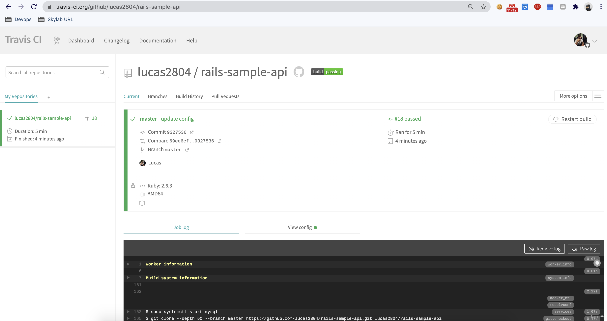
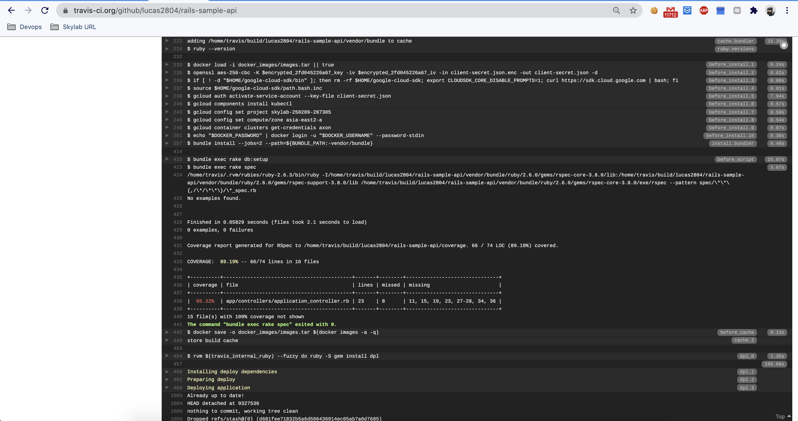
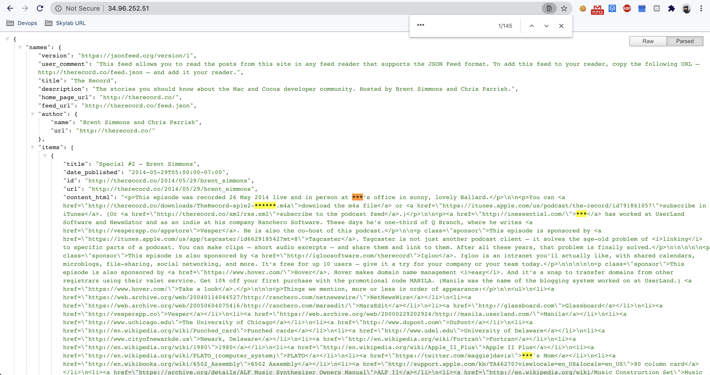

# II - Rails Sample Restful

- Current production url: **http://34.96.252.51**

### I - Tech stack

- CI-CD by Travis which includes (.travis.yml): 
    + run automation tests of rails-sample-api
    + run rake db:setup; rake db:migrate; rspec
    + cache rvm, cache docker images, cache google cloud
    + build, tag, push docker image by $SHA to make sure k8s can always update new image and RollingUpdate with zero downtime
        + docker build -t lucdang/rails-sample-api:$SHA -f ./Dockerfile ./
        + kubectl set image deployments/rails-sample-api rails-sample-api=lucdang/rails-sample-api:$SHA
    + Grant access permission from Travis-CI to cluster by service-account-IAM
    + Deploy to Google Cloud K8s cluster
    + `kubectl set image` to make sure update new image instead of use `latest` tag

- `kubectl apply -f secret` in `deploy.sh` to create configmap and secret 
- `kubectl -f auto_deploy_kubernetes` in `deploy.sh` to create ingresses, services, deployments...
- All secrets are created under base64 encode files BUT:
    + create secret manually is better solution for security purpose
    + User vault service is a good approach to store sensitive data
- Use RoR for api server
- Use Mysql as DB

```yaml
services:
  - mysql
  - docker
env:
  global:
    - SHA=$(git rev-parse HEAD)
    - CLOUDSDK_CORE_DISABLE_PROMPTS=1
language: ruby
rvm:
  - 2.6.3
cache:
  - bundler: true
  - directories:
    - "$HOME/google-cloud-sdk/"
    - docker_images
    - /home/travis/.rvm/
before_cache:
  - docker save -o docker_images/images.tar $(docker images -a -q)
before_install:
  - docker load -i docker_images/images.tar || true
  - openssl aes-256-cbc -K $encrypted_2fd045226a67_key -iv $encrypted_2fd045226a67_iv -in client-secret.json.enc -out client-secret.json -d
  - if [ ! -d "$HOME/google-cloud-sdk/bin" ]; then rm -rf $HOME/google-cloud-sdk; export CLOUDSDK_CORE_DISABLE_PROMPTS=1; curl https://sdk.cloud.google.com | bash; fi
  - source $HOME/google-cloud-sdk/path.bash.inc
  - gcloud auth activate-service-account --key-file client-secret.json
  - gcloud components install kubectl
  - gcloud config set project skylab-250209-287305
  - gcloud config set compute/zone asia-east2-a
  - gcloud container clusters get-credentials axon
  - echo "$DOCKER_PASSWORD" | docker login -u "$DOCKER_USERNAME" --password-stdin
bundler_args: --jobs=2
jobs:
  include:
    - stage: unit tests
      before_script: "bundle exec rake db:setup"
      script: "bundle exec rake spec"

deploy:
  provider: script
  script: bash ./deploy.sh
  on:
    branch: master
```


### II - BONUS: how you would handle zero-downtime upgrades of the service

- **`I've already implemented zero downtime`** on deployment `rails-sample-api`
- Use terms: strategy, maxSurge, maxUnavailable, RollingUpdate, readinessProbe, preStop

- Explain how it work:
    + maxUnavailable=50%: specifies the maximum number of Pods that can be unavailable during the update process. 
    + maxSurge=50%: specifies the maximum number of Pods that can be created 
    + RollingUpdate: The deployment update pod by pod depends on maxUnavailable, maxSurge instead of kill all which lead to downtime
    + readinessProbe: to make sure the server is actually ready to receive requests (fill in spec.containers)
    + preStop-sleep 15s: waiting for a while before send shutdown signal to make sure load balancer stop send request.

```json
{
  "kind": "Deployment",
  "spec": {
    "replicas": 2,
    "selector": {
      "matchLabels": {
        "app": "rails-sample-api"
      }
    },
    "strategy": {
      "rollingUpdate": {
        "maxSurge": "50%",
        "maxUnavailable": "50%"
      },
      "type": "RollingUpdate"
    },
    "template": {
      "spec": {
        "containers": [
          {
            "args": [
              "bundle",
              "exec",
              "rails",
              "s",
              "-b",
              "0.0.0.0",
              "puma"
            ],
            "name": "rails-sample-api",
            "image": "lucdang/rails-sample-api",
            "readinessProbe": {
              "httpGet": {
                "path": "/healthz",
                "port": 3000
              },
              "initialDelaySeconds": 5,
              "periodSeconds": 5,
              "successThreshold": 1
            },
            "lifecycle": {
              "preStop": {
                "exec": {
                  "command": [
                    "/bin/bash",
                    "-c",
                    "sleep 15"
                  ]
                }
              }
            },
            "ports": [
              {
                "containerPort": 3000
              }
            ],
            "envFrom": [
              {
                "configMapRef": {
                  "name": "rails-config-map"
                }
              },
              {
                "secretRef": {
                  "name": "rails-secret"
                }
              }
            ],
            "imagePullPolicy": "Always"
          }
        ],
        "restartPolicy": "Always",
        "imagePullSecrets": [
          {
            "name": "lucdang-regcred"
          }
        ]
      },
      "metadata": {
        "name": "service-sptel-api",
        "labels": {
          "app": "rails-sample-api"
        },
        "namespace": "default"
      }
    }
  },
  "metadata": {
    "name": "rails-sample-api",
    "labels": {
      "app": "rails-sample-api"
    },
    "namespace": "default"
  },
  "apiVersion": "apps/v1"
}
```

### III - Simple Ruby Server

- I've implemented by Ruby because I'm not familiar with Python or Go, I can learn them fast but cant learn in 1 day.
- In the content_html response, I've redact author names to `***` then response data.









```ruby
module Users
  class CollectNameService
    def execute
      rest_params = rest_params(:get, url, {})
      ap rest_params
      begin
        response = ::RestClient::Request.execute(rest_params)
        body = JSON.parse(response.body)

        sensitive_name_str = sensitive_names(body)
        result = transform_content_html(sensitive_name_str, body)

        ::OpenStruct.new(result: result, error: nil)
      rescue ::RestClient::ExceptionWithResponse, ::RestClient::NotFound, ::StandardError => error
        ap error
        ap error.backtrace
        ::OpenStruct.new(result: nil, error: error)
      end
    end

    private

    def transform_content_html(sensitive_name_str, body)
      regex = Regexp.new(sensitive_name_str, true)
      body['items'].each_with_index do |item, index|
        body['items'][index]['content_html'].gsub!(regex, '***')
      end
      body
    end

    def sensitive_names(body)
      names = []
      body['items'].each do |item|
        names << item['url']&.split('/')&.last.titleize.split(' ')
      end
      names.flatten.join('|')
    end

    def rest_params(method, url, payload)
      {
        method: method,
        url: url,
        headers: {
          content_type: 'application/json;charset=UTF-8',
          accept: 'application/json'
        },
        payload: payload.to_json,
        verify_ssl: false
      }
    end

    def url
      'http://therecord.co/feed.json'
    end
  end
end
```
